<div align="center">

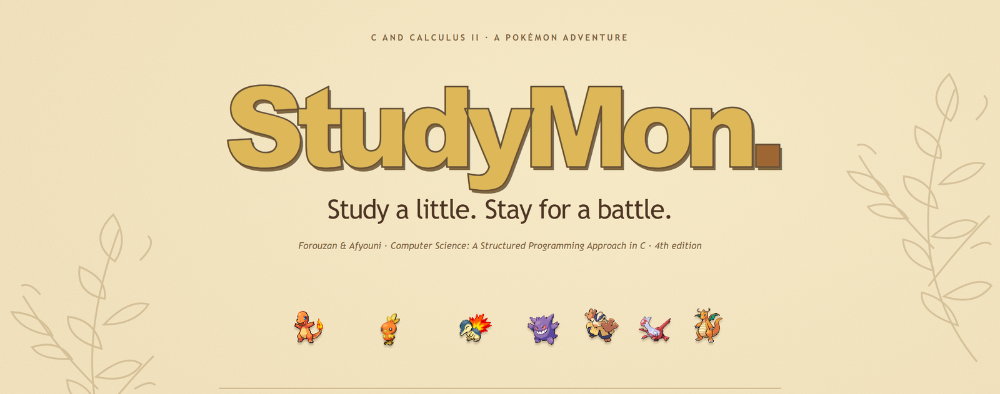

### A Pokémon-style adventure where every attack is a question.

**Learn C programming and Calculus II by catching, battling and exploring your way through two whole regions.**

<br>


<br>

[**Play it**](#-play-it) &nbsp;·&nbsp; [How battles work](#-every-attack-is-a-question) &nbsp;·&nbsp; [Two regions](#-two-regions-two-courses) &nbsp;·&nbsp; [Study tools](#-the-study-tools) &nbsp;·&nbsp; [Side Quests](#-side-quests-write-real-c) &nbsp;·&nbsp; [Collecting](#-gotta-study-em-all) &nbsp;·&nbsp; [Kingdom](#-pokémon-kingdom) &nbsp;·&nbsp; [Under the hood](#-under-the-hood)

</div>

<br>

## ✦ What is StudyMon?

StudyMon turns a textbook into a creature-collecting RPG. Pick a starter, walk a route, and meet a wild Pokémon. To use a move you have to **answer a question** from your course, and the stronger the move, the harder the question. Win battles to level up and evolve your team, earn gym badges chapter by chapter, and slowly fill a Pokédex of every Pokémon that has ever existed.

It is built around two real university courses:

| | **The C-Region** | **The Converging Isles** |
|---|---|---|
| **Subject** | C programming | Calculus II |
| **Follows** | *Computer Science: A Structured Programming Approach in C*, Forouzan & Afyouni, 4th ed. | The Calculus II syllabus: vectors through series, Taylor and polar coordinates |
| **World** | 15 routes, 15 gyms, an Elite Four and a Champion | 10 routes, 10 gyms, 3 evening exams and a Final |
| **Questions** | 1,025 | 1,735 |

Everything runs in your browser, offline, with no account and no install step. Your progress is saved on your own machine.

<br>

## ✦ At a glance

| Feature | What you get |
|---|---|
| 🐾 **1,046 Pokémon** | All 1,025 official species, each with front, back and shiny sprites and cries, plus **21 original StudyMon creatures** |
| 📚 **2,760 questions** | Every one with an explanation of *why*, not just which letter was right |
| 🏟 **25 gyms** | One per chapter in the C-Region, one per quiz in the Converging Isles, each led by a named Gym Leader |
| 💻 **49 Side Quests** | Write real C in the game, compiled by Clang inside your browser and graded against hidden tests |
| 🎬 **98 cutscenes** | Every Side Quest has an opening and a closing scene, with portraits and painted backdrops |
| 🌿 **Pokémon Kingdom** | A living pixel-art forest town where your whole collection wanders, with day, night and rain |
| 🎧 **Radio and Pokédoro** | A built-in radio with over a hundred tracks and a focus timer that pays your party in XP |
| 🧪 **60+ automated checks** | Real battles, catches, evolutions and graded labs are played through in a real browser |

<br>

## ✦ Every attack is a question

You choose a move. The game asks a question whose difficulty matches the move's power. Right answers land the hit, and wrong answers fizzle it and let the opponent punish you.

<table>
<tr>
<td width="50%" valign="top">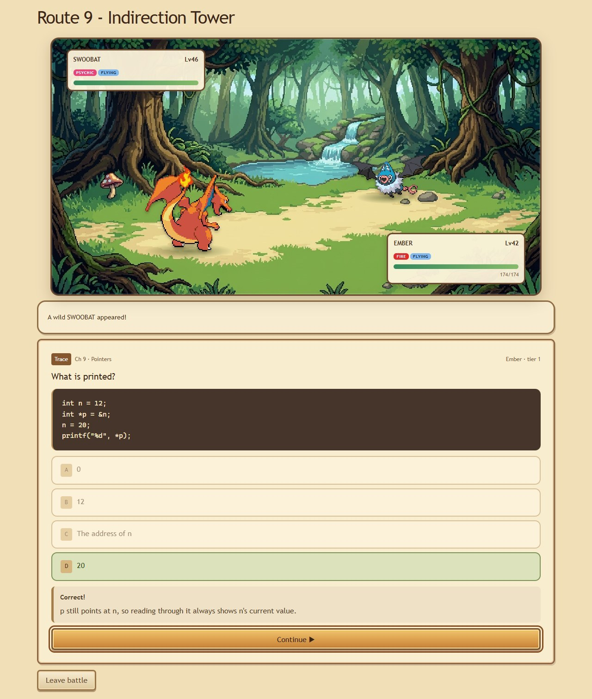</td>
<td width="50%" valign="top">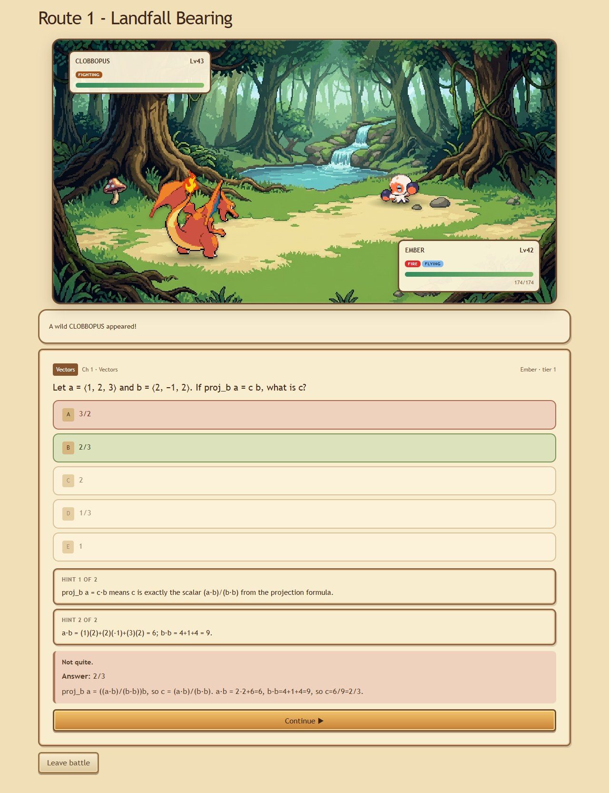</td>
</tr>
<tr>
<td align="center"><sub><b>C-Region.</b> A pointer trace on Route 9. The answer comes with a short explanation of why.</sub></td>
<td align="center"><sub><b>Converging Isles.</b> A wrong answer reveals stepped hints and the full worked solution.</sub></td>
</tr>
</table>

| Move tier | Unlocks at | What it asks |
|:---:|:---:|---|
| ★☆☆☆ | Lv 1 | **Recall:** definitions, syntax, which header |
| ★★☆☆ | Lv 8 | **Apply:** short traces, single-concept output |
| ★★★☆ | Lv 18 | **Analyse:** multi-step traces, bug hunts |
| ★★★★ | Lv 30 | **Synthesis:** undefined behaviour, subtle gotchas |

- **Right answer:** your move lands and the counter-attack only does 35% damage.
- **Wrong answer:** your move fizzles and the opponent hits for 150%.
- **Speed and streaks** earn bonus damage, and a run of correct answers boosts your prize money.
- **The balance was tuned by simulation.** A gym win is about 85% at near-perfect accuracy, about 55% at 70%, and under 10% at 45%. You cannot grind past not knowing the material.
- **Levels scale to you.** Wild Pokémon and gym leaders stay near your own party's level, so any route is playable on the night you are actually studying that chapter.
- **Calculus reads like calculus.** Converging Isles questions are typeset as you go: stacked fractions, raised powers, square roots with a bar, and integrals and sums with their limits in place.
- **Stuck? Copy it.** The **Copy** button at the top right of every question card copies the question and its lettered choices, ready to paste into Gemini or any other assistant.

Keyboard friendly: `1`–`4` or `A`–`D` to answer, `Enter` to continue.

<br>

## ✦ Two regions, two courses

<table>
<tr>
<td width="50%" valign="top">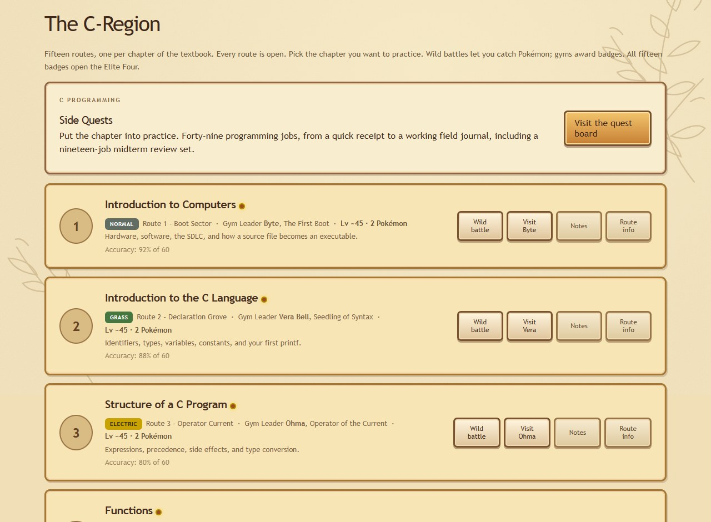</td>
<td width="50%" valign="top">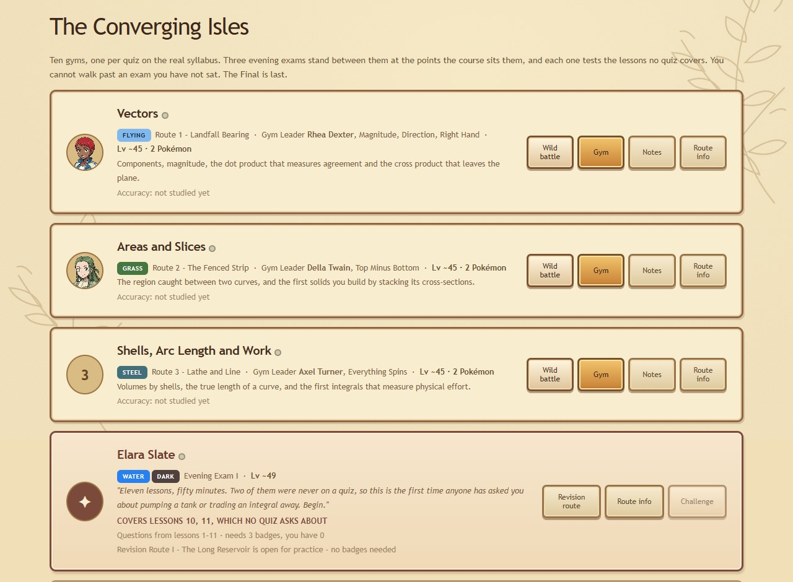</td>
</tr>
<tr>
<td align="center"><sub><b>The C-Region.</b> One route per chapter. Every route is open from day one.</sub></td>
<td align="center"><sub><b>The Converging Isles.</b> Gym leaders have portraits, and every gym and evening exam is open from day one.</sub></td>
</tr>
</table>

Each chapter is a **route** (wild battles to catch Pokémon and practise) with a **gym** at the end (a Gym Leader and a badge). Chapters map to Pokémon types as a memory aid: Pointers are Ghost because of *indirection*, Arrays are Rock because they are *one contiguous block*, and Structures are Steel because of *padding*.

The **ferry** in the top bar sails you between regions. Your team, money and friends come with you. Each region keeps its own badges and review progress.

<details>
<summary><b>The C-Region: all fifteen gyms</b></summary>

<br>

| Ch | Topic | Type | Gym Leader | Badge |
|:-:|---|:-:|---|---|
| 1 | Introduction to Computers | Normal | Byte | Boot |
| 2 | Introduction to the C Language | Grass | Vera Bell | Hello |
| 3 | Structure of a C Program | Electric | Ohma | Operand |
| 4 | Functions | Fighting | Callum | Return |
| 5 | Selection: Making Decisions | Psychic | Elsie Fitz | Branch |
| 6 | Repetition | Flying | Willa Doo | Loop |
| 7 | Text Input/Output | Water | Scanlon Prince | Stream |
| 8 | Arrays | Rock | Indira Bounds | Index |
| 9 | Pointers | Ghost | Astrid Starr | Deref |
| 10 | Strings | Fairy | Nula Terminel | NUL |
| 11 | Enumerated, Structure and Union Types | Steel | Padma Align | Struct |
| 12 | Binary Input/Output | Ice | Fee Seeker | Seek |
| 13 | Bitwise Operators | Bug | Xora Mask | Mask |
| 14 | Lists | Dragon | Linka Head | Node |
| 15 | Recursion | Psychic | Reva Call | Base Case |

All fifteen badges open the **Elite Four**: Seg Fault, Ida Overflow, Fee Seeker II and Uma Bee, then **Champion ANSI**.

</details>

<details>
<summary><b>The Converging Isles: all ten gyms and the evening exams</b></summary>

<br>

| Ch | Topic | Type | Gym Leader | Badge |
|:-:|---|:-:|---|---|
| 1 | Vectors | Flying | Rhea Dexter | Arrow |
| 2 | Areas and Slices | Grass | Della Twain | Between |
| 3 | Shells, Arc Length and Work | Steel | Axel Turner | Revolution |
| | *Evening Exam I* | | Elara Slate | |
| 4 | Trigonometric Integrals | Electric | Cosima Wave | Identity |
| 5 | Substitution and Partial Fractions | Ghost | Thea Sinclair | Triangle |
| 6 | Improper Integrals and Sequences | Dragon | Lim Everard | Infinity |
| | *Evening Exam II* | | Otto Graff | |
| 7 | Series and the First Tests | Poison | Cora Verge | Convergence |
| 8 | Alternating Series and Choosing a Test | Dark | Alta Rennick | Alternating |
| | *Evening Exam III* | | Sera Conn | |
| 9 | Power Series and Taylor Series | Psychic | Rae Diuss | Radius |
| 10 | Taylor at Work and Polar Coordinates | Fairy | Rose Kardia | Rose |
| | ***The Final*** | | Dean Aster | |

Across the 35 lessons, the quizzes cover most of the course. The **evening exams** test the lessons that no quiz asks about, so there is nowhere to hide. Nothing is locked behind badges: every gym, route and exam is open from the start, so you can study whatever your class is on this week, in any order. A gym fights like the next badge you are due, whichever one you pick. Each exam also has a **Revision Route** for practice.

</details>

<br>

## ✦ The study tools

The game is the sugar. These are the parts that actually move an exam grade.

<table>
<tr>
<td width="50%" valign="top">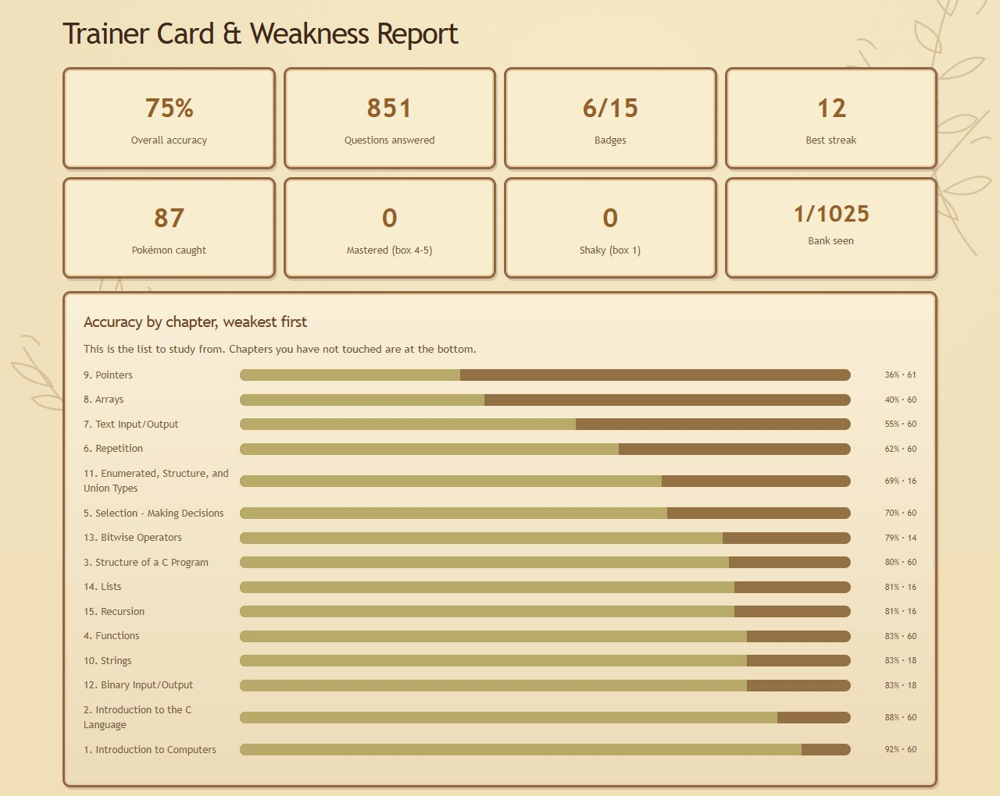</td>
<td width="50%" valign="top">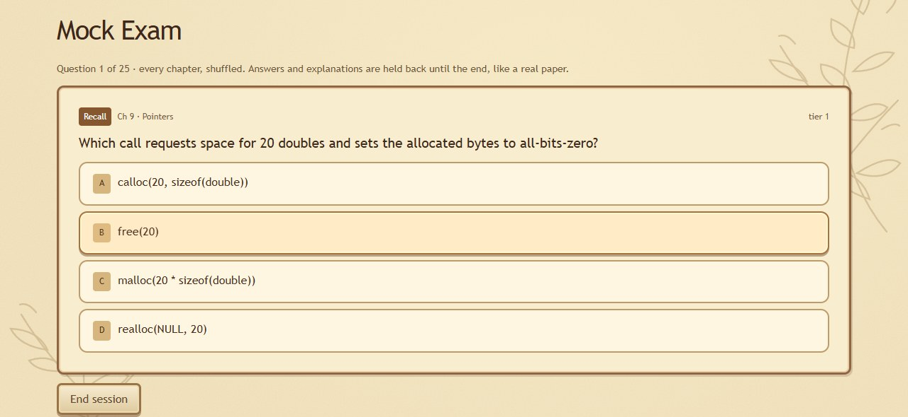</td>
</tr>
<tr>
<td align="center"><sub><b>Trainer Card.</b> Accuracy per chapter, weakest first. This is the list to study from.</sub></td>
<td align="center"><sub><b>Mock Exam.</b> 25 or 50 shuffled questions, no feedback, a worked review at the end.</sub></td>
</tr>
</table>

- 🔁 **Spaced repetition.** A Leitner box system runs under everything. A missed question drops to box 1 and comes back in two questions. One you keep getting right climbs to box 5 and will not return for a hundred. It works across battles, drills and exams alike, and the top bar shows how many reviews are due.
- 🧮 **A different schedule for Calculus.** The Isles are built for exposure, not drilling. A right answer returns after about 50 questions and a wrong one after about 25, never on an exact count. New questions are picked by *problem type*, so you meet many kinds of problem instead of ten copies of one. Answer one right three times running and it is retired.
- 🪜 **Hints that teach.** Calculus problems reveal stepped hints and then a complete worked solution, so the study loop never depends on an outside tutor.
- 📖 **Move Tutor.** A condensed, exam-focused notes sheet for every chapter, with a self-check coding task and one-click jumps to a wild battle, the gym or a plain drill.
- 🔍 **Review Center and chapter drills.** Pure Q&A with no battle, on whatever is due or on one chapter.
- 📝 **Route Info.** Every route lists everything that lives there as a silhouette until you catch it, and shows how many of its questions you have met.

<table>
<tr>
<td width="50%" valign="top">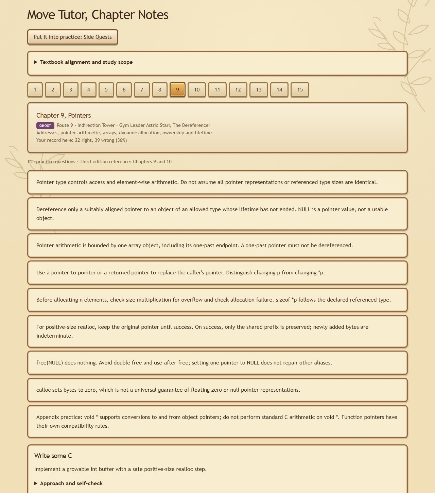</td>
<td width="50%" valign="top">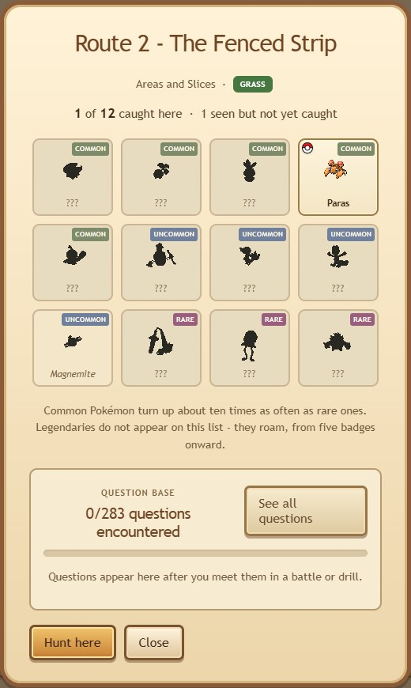</td>
</tr>
<tr>
<td align="center"><sub><b>Move Tutor.</b> Exam-focused notes for each chapter.</sub></td>
<td align="center"><sub><b>Route Info.</b> Silhouettes until caught, plus how many of the route's questions you have met.</sub></td>
</tr>
</table>

<br>

## ✦ Side Quests: write real C

Forty-nine programming jobs, handed out by the people of the region, from a quick receipt to a working field journal. **18 easy, 15 medium and 16 hard**, including a nineteen-job midterm review set.

<table>
<tr>
<td width="50%" valign="top">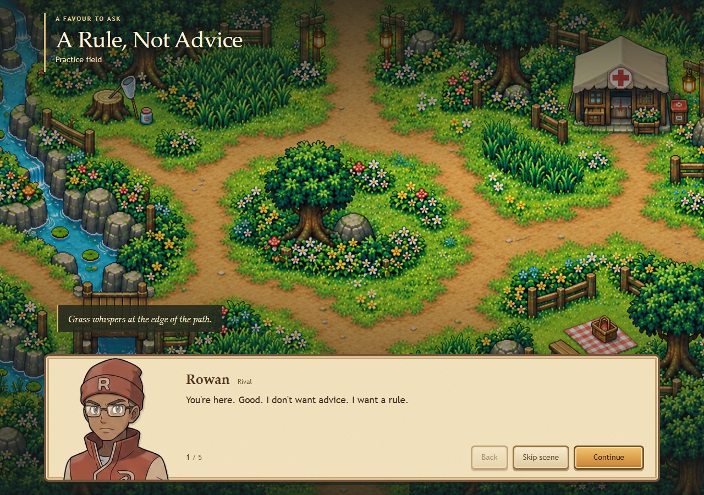</td>
<td width="50%" valign="top">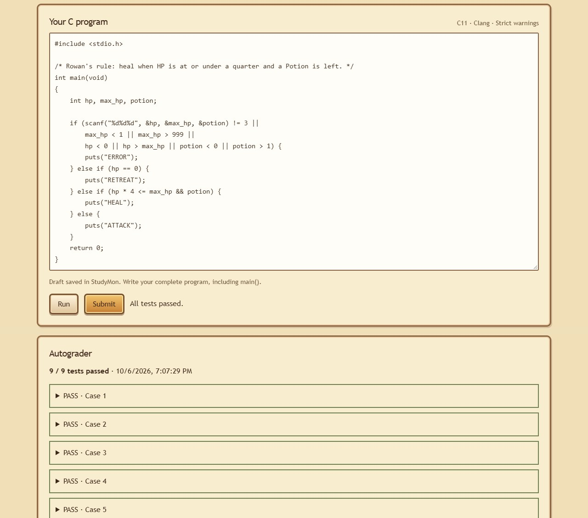</td>
</tr>
<tr>
<td align="center"><sub><b>The brief.</b> Every job opens and closes with a cutscene.</sub></td>
<td align="center"><sub><b>The workshop.</b> Write C, press Run to try it, press Submit to be graded.</sub></td>
</tr>
</table>

- **Real compilation.** Your program is compiled by **Clang running as WebAssembly inside the page**, with C11 and strict warnings (`-Wall -Wextra -Werror -pedantic-errors`). Nothing is uploaded and you need no compiler installed.
- **Real grading.** Submit runs your code against every hidden test, in a fresh in-memory sandbox, with limits on time, memory and output. The reward is paid out **once, and only when every test passes**.
- **Two styles of lab.** Some ask for a whole program. Others hand you function signatures to implement while the game supplies `main()`.
- **Saved drafts, hints and a chapter guide** sit beside every job, and rewards (money and berries) can be used from the Party screen.
- **Story.** Each job comes with an opening and a closing scene, with portraits and painted backdrops. Finishing jobs earns keepsakes for your Lab Bench.

<br>

## ✦ Gotta study 'em all

<table>
<tr>
<td width="50%" valign="top">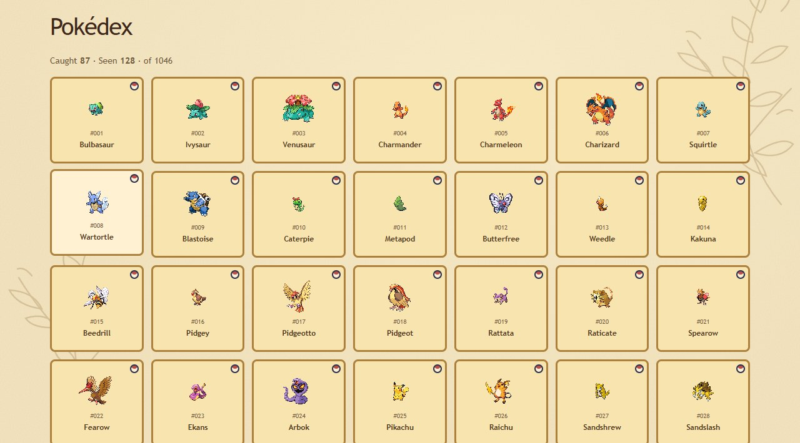</td>
<td width="50%" valign="top">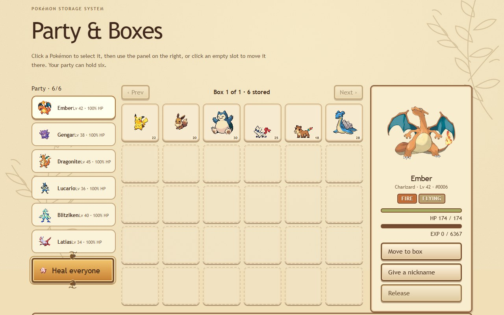</td>
</tr>
<tr>
<td align="center"><sub><b>Pokédex.</b> 1,046 entries and counting.</sub></td>
<td align="center"><sub><b>Party and Boxes.</b> A proper storage system with nicknames and evolution paths.</sub></td>
</tr>
</table>

- **Every Pokémon.** All 1,025 official species plus the originals below, each with its own front, back and shiny sprite.
- **The real catch formula.** Catching uses the Generation III/IV maths with four 16-bit shake checks, not an invented one. A Caterpie and a Lugia are as far apart here as they are in the games. Your *study* replaces the status condition: a wrong answer is a penalty, a right answer is a bonus, and three correct in a row is a "focus" bonus. To catch something rare, be answering well when you throw.
- **Choose your starter.** Twenty-nine of them: every regional trio from Kanto through Paldea, plus Pikachu and Eevee, with Hisui and Legends Z-A selections too. Preview before you commit.
- **Legendaries roam.** After five badges, about 3% of wild encounters turn up something that should not be there. They arrive above your level and resist the ball hard.
- **Shinies** appear at 1 in 1,000, and a shiny encounter announces itself in the battle log and a toast.
- **Evolve and choose.** Branching evolutions let you pick the path when you are ready.
- **A Poké Mart.** Poké Balls are free and unlimited. Money buys *better* balls and potions, so "is this one worth an Ultra Ball?" is a real decision. Prize money comes from battles, and it grows once your streak reaches five.

### 21 originals

Besides the official roster there are **21 original StudyMon creatures** (#1026–#1046), including the Papyrunt → Codexal → Lexidrake line and the Isles' regional starter line, Drenchic → Condusken → Blitziken.

<div align="center">
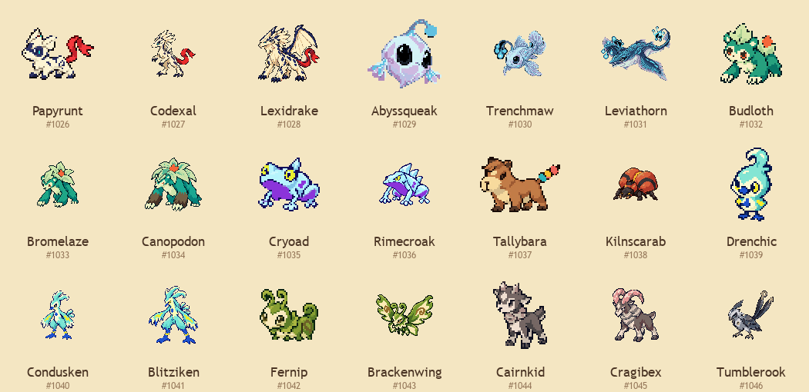
</div>

<br>

## ✦ Pokémon Kingdom

Your collection does not just sit in a box. In the **Pokémon Kingdom**, every Pokémon you own lives a life in a ten-district pixel-art forest town: Kingdom Green, Lantern Square, Berry Market, Riverside Walk, Hearthside Lane, Moonbell Hill, Mossroot Gym, Honeywind Orchard, Emberstone Springs and Starglass Observatory.

<div align="center">
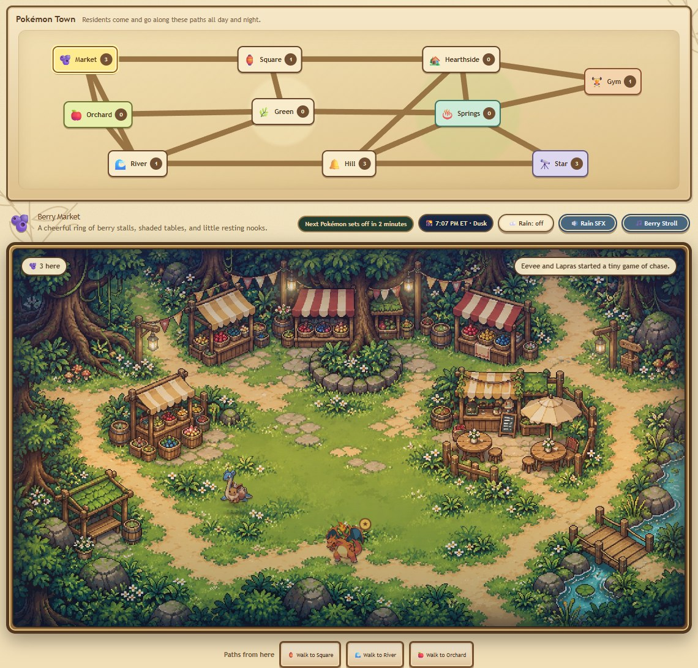
</div>

- 🚶 **They wander.** Residents settle in for a while, then follow the paths somewhere new. Your party wears a gold star, and the whole population changes district at the top of every real-world hour.
- 🌗 **Day, night and rain.** The town follows the clock through dawn, day, dusk and night. Rain brings falling streaks, splashes, mist and a layered rain sound. Twenty painted lanterns flicker once the sun goes down.
- 🎵 **Original music.** Each district has its own low-fatigue procedural score with its own tempo, harmony and lead voice, and moving between districts crossfades the themes.
- ✋ **Pick one up.** Tap a Pokémon to say hello, or hold the hand on it to lift it and carry it somewhere else. Mossroot Gym has training stations: a climbing wall, hanging bags, balance logs and agility hurdles.
- 🧱 **Solid ground.** Hand-authored walkable areas keep residents off buildings, water, stalls and benches, while Pokémon themselves stay non-solid so friends can bunch up naturally.

<br>

## ✦ Radio and Pokédoro

<table>
<tr>
<td width="50%" align="center" valign="top">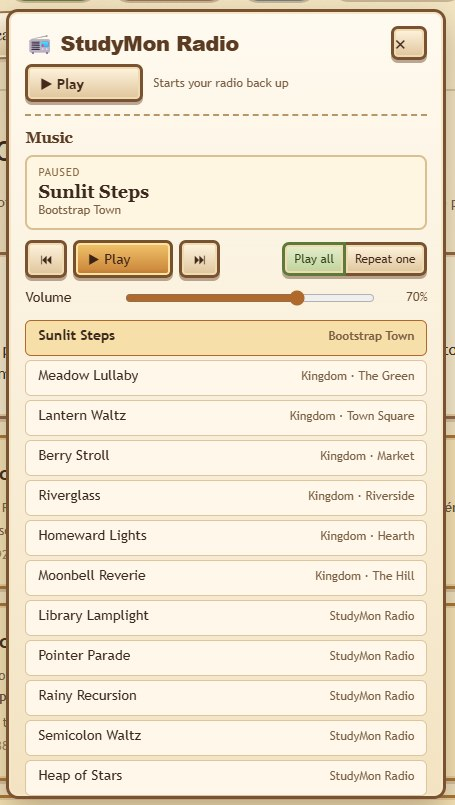</td>
<td width="50%" align="center" valign="middle">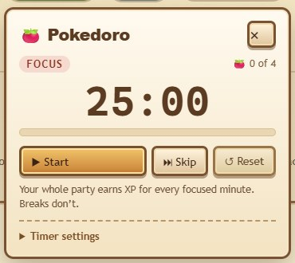</td>
</tr>
</table>

- 📻 **StudyMon Radio** is a built-in music player in the top bar, with play-all and repeat-one, a volume slider and **over a hundred tracks**, including a theme for each Kingdom district. You can also drop in your own files (see [`assets/music/README.md`](assets/music/README.md)).
- 🍅 **Pokédoro** is a Pomodoro timer with a twist: **your whole party earns XP for every focused minute**, and breaks do not. The timer is adjustable.

<br>

## ✦ Also built, currently switched off

Some systems are fully built and saved, but their menu buttons are hidden for now (`TOWN_UI_ENABLED = false` in [`js/engine/ui.js`](js/engine/ui.js)). Nothing was deleted.

- 🏘 **Bootstrap Town:** an 18-scene walkable community with 45 homes, 17 public buildings and a connected town map.
- 💛 **Friendship:** a large cast of townspeople and companions who can become friends, with heart-event scenes, gifts, rumours and mail.
- 📔 **A journal and collection:** one notebook page per day, plus a chest, an aquarium and a terrarium for keepsakes ([design notes](COLLECTABLES.md)).

<br>

## ✦ Play it

### The easy way (Windows)

Double-click **`Play StudyMon.bat`**. It starts a tiny local server and opens your browser. Leave the black window open while you play and close it when you are done.

### Any platform

You only need [Node.js](https://nodejs.org) or Python 3 to serve the folder:

```bash
git clone https://github.com/radhepa/StudyMon.git
cd StudyMon
node tools/serve.js 8777
```

Then open <http://localhost:8777>. If you prefer Python, `python tools/serve.py 8777` does the same job.

> **Heads up:** the full Pokédex art and cries live in the repo so the game works offline, which makes a fresh clone large (several hundred MB).

You can also double-click `index.html`, but some browsers refuse to save progress for pages opened straight from disk. The launcher is the safe route, and the game warns you if saving is blocked.

### Your save

Progress lives in your browser's local storage under keys that start with `studymon.`. From the **Trainer Card** screen you can **export** your save to a file, **import** one, or erase everything. Export before you clear your browser data.

<br>

## ✦ Under the hood

StudyMon is plain **HTML, CSS and JavaScript** with no framework, no bundler and no build step. Open the folder and it runs.

```text
index.html               the game
Play StudyMon.bat        Windows launcher (starts a local server, opens the browser)
css/                     one stylesheet per feature: parchment theme, kingdom, radio, labs...
js/data/                 species, questions, gyms, side quests, cast, songs, scenes
js/data/questions/       the C question bank, merged at load time
js/data/calc/            the Calculus II lessons, questions and world
js/engine/               state, battle, quiz and spaced repetition, UI, kingdom, radio
assets/                  sprites, cries, portraits, painted scenes, the WASM compiler
tools/                   data builders, a tiny server and 60+ browser checks
```

- **Offline by design.** Pokémon data, sprites and cries were fetched from [PokéAPI](https://pokeapi.co) once and live in `assets/`.
- **The compiler** is [wasm-clang](https://github.com/binji/wasm-clang) (Clang and LLD compiled to WebAssembly) with a [browser WASI shim](https://github.com/bjorn3/browser_wasi_shim) running the result in an in-memory sandbox. See [`assets/compiler/ATTRIBUTION.md`](assets/compiler/ATTRIBUTION.md).
- **Tested against a real browser.** `node tools/check-all.cjs` drives real wild and gym battles to completion, catches, evolutions, the ferry, the PC, the spaced-repetition boxes, friend scenes and the Side Quest autograder. Every run seeds its own save in throwaway storage, so your own save is never touched. See [`TESTING.md`](TESTING.md).
- **Saves are migrated.** Older saves are upgraded on load, and old question IDs stay valid.

### Add your own questions

Open the file for a chapter group and add an entry. The game picks it up on reload.

```js
{ id: 'c9-24', t: 2, k: 'mcq', tag: 'Trace',
  q: 'What is printed?',
  code: 'int x = 5;\nint *p = &x;\nprintf("%d", *p);',
  c: ['5', 'The address of x', 'Garbage', '0'], a: 0,
  why: 'p holds the address of x, so *p reads the value stored there.' },
```

`t` is the tier (1–4), `k` is `'mcq'` or `'fill'`, and `why` is the part that teaches, so always fill it in.

### More documentation

| | |
|---|---|
| [`docs/DEVELOPER-NOTES.md`](docs/DEVELOPER-NOTES.md) | How each system was built and the maths behind it |
| [`TESTING.md`](TESTING.md) | Every check suite and what it proves |
| [`COLLECTABLES.md`](COLLECTABLES.md) | The collection and keepsake design |
| [`assets/compiler/ATTRIBUTION.md`](assets/compiler/ATTRIBUTION.md) | Third-party toolchain credits and licences |

<br>

## ✦ Credits and legal

- **StudyMon is an unofficial, non-commercial fan and study project.** Pokémon and Pokémon character names are trademarks of Nintendo, Creatures Inc. and GAME FREAK. This project is not affiliated with or endorsed by any of them.
- Official Pokémon data, sprites and cries come from [PokéAPI](https://pokeapi.co).
- The textbook questions and Calculus problems are **original**, written to match the topics and style of the course material. They are not copied from it.
- The StudyMon creatures, the characters and portraits, the painted scenes and the music are original to this project.
- Clang, LLD, the WASI shim and their licences are credited in [`assets/compiler/ATTRIBUTION.md`](assets/compiler/ATTRIBUTION.md).

<div align="center">
<br>

*Study a little. Stay for a battle.*

</div>
